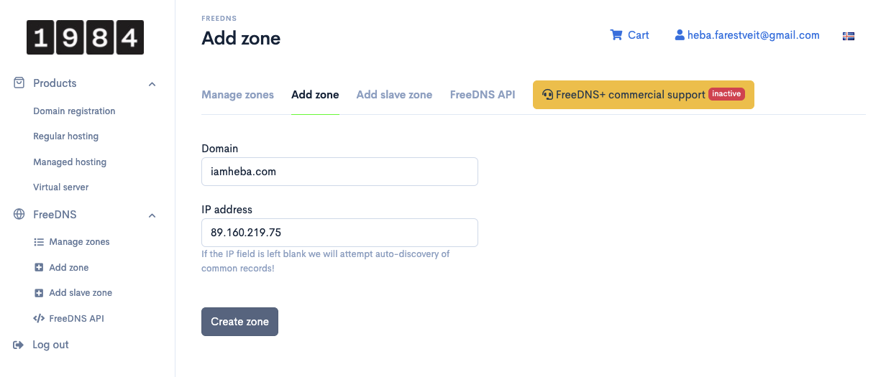
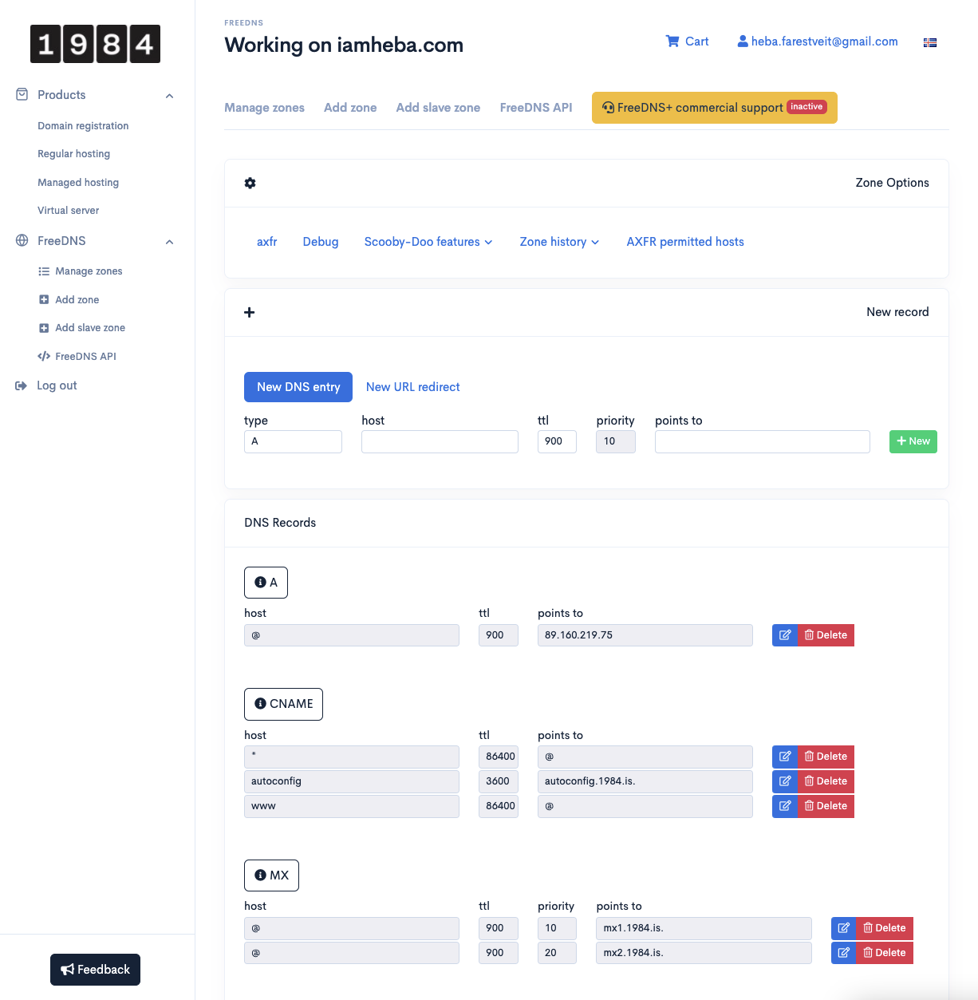
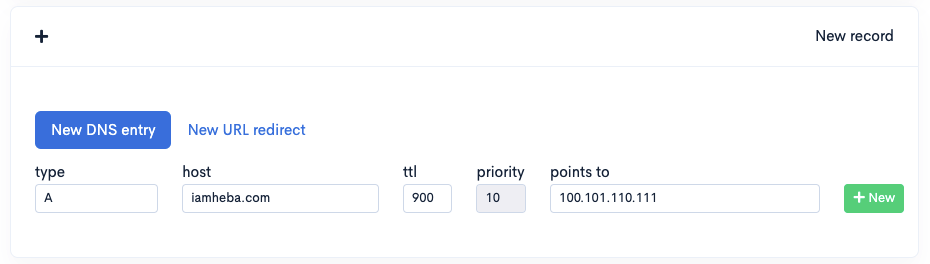
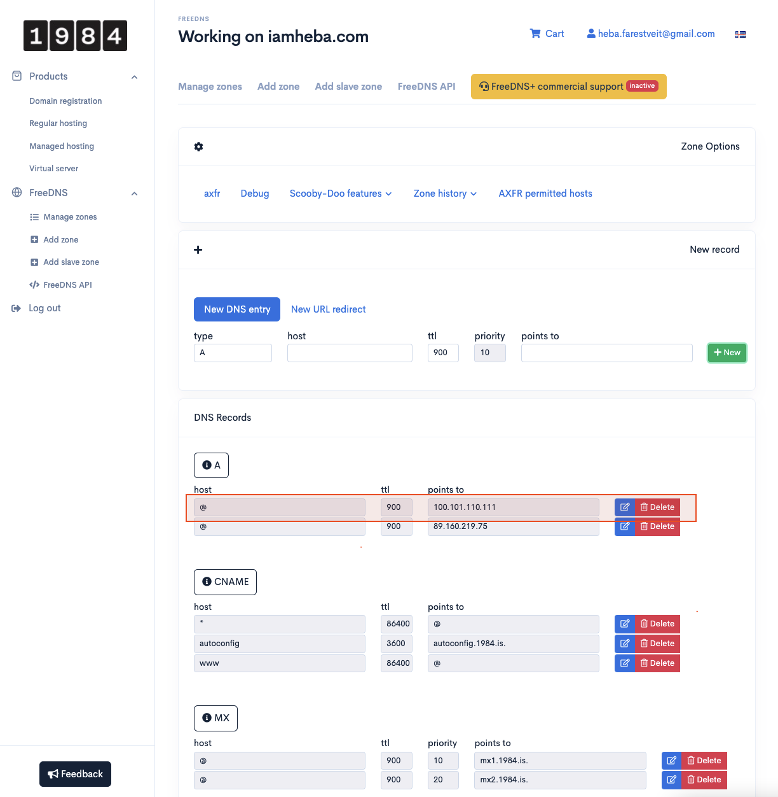
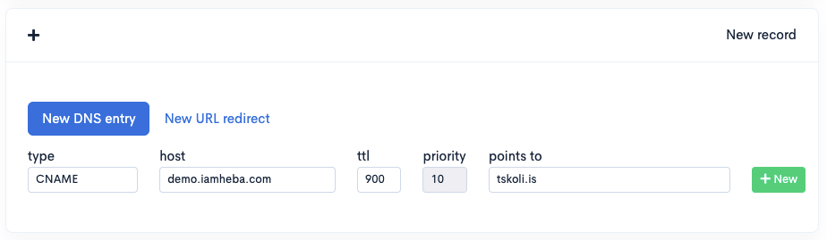
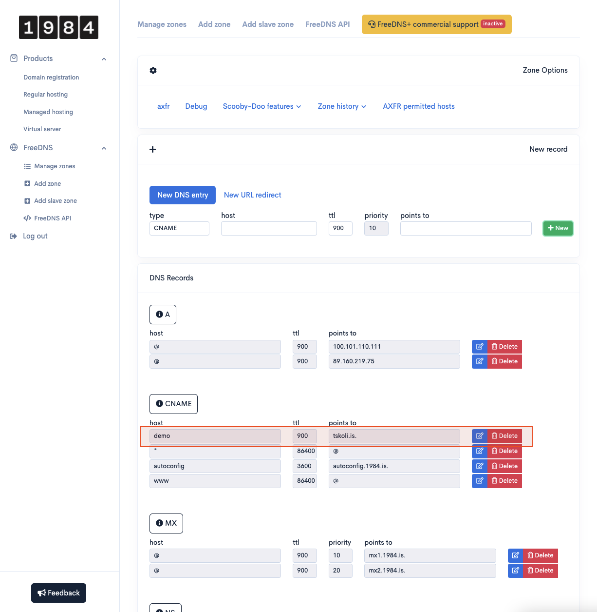

# Back End - DNS
I followed the guide instructions and signed up for the freeDNS service at 1984. Here are my screenshots:   

### Adding DNS zone

  

 

### View before adding new DNS entry

  

 

### Adding A-record of my domain to point to my server

  

 

### View after adding A-record of my domain to point to my server IP address

  

 

### Adding CNAME-record of demo.iamheba.com to point to tskoli.is

  

 

### View after adding CNAME-record of my demo.domain to point to tskoli.is

  

 

## DNS
The Domain Name System (DNS) is the phonebook of the Internet. Humans access information online through domain names, like nytimes.com or espn.com.  
The process of DNS resolution involves converting a hostname (such as www.example.com) into a computer-friendly IP address (such as 192.168.1.1). An IP address is given to each device on the Internet, and that address is necessary to find the appropriate Internet device - like a street address is used to find a particular home. When a user wants to load a webpage, a translation must occur between what a user types into their web browser (example.com) and the machine-friendly address necessary to locate the example.com webpage.  

 

## IP protocol
The Internet Protocol (IP) is a protocol, or set of rules, for routing and addressing packets of data so that they can travel across networks and arrive at the correct destination. Data traversing the Internet is divided into smaller pieces, called packets. IP information is attached to each packet, and this information helps routers to send packets to the right place. Every device or domain that connects to the Internet is assigned an IP address, and as packets are directed to the IP address attached to them, data arrives where it is needed.  

 

## IPv4 vs. IPv6
IPv4 stands for Internet Protocol version 4. It is the underlying technology that makes it possible for us to connect our devices to the web. Whenever a device accesses the Internet, it is assigned a unique, numerical IP address. Most Internet traffic runs on IPv4, which uses a 32-bit address space which provides 4,294,967,296 (232) unique addresses, but large blocks are reserved for special networking purposes.
As the Internet has grown exponentially, the IPv4 address space is slowly running out of new addresses. IPv6 is the latest Internet protocol which expands the IP address space to 128-bit, allowing 2128 addresses. Where IPv4 addresses consist of four bytes e.g. 128.4.32.241, IPv6 address consist of eight groups of four hex digits e.g. 2400:6180:0000:00D0:0000:0000:0129:E001.   
IPV6 is built with the future in mind.

 

## DNS record
DNS records (aka zone files) are instructions that live in authoritative DNS servers and provide information about a domain including what IP address is associated with that domain and how to handle requests for that domain. These records consist of a series of text files written in what is known as DNS syntax. DNS syntax is just a string of characters used as commands that tell the DNS server what to do. All DNS records also have a ‘TTL’, which stands for time-to-live, and indicates how often a DNS server will refresh that record.

### What are the most common types of DNS record?
- **A record** - The record that holds the IP address of a domain.
- **AAAA record** - The record that contains the IPv6 address for a domain (as opposed to A records, which list the IPv4 address).
- **CNAME record** - Forwards one domain or subdomain to another domain, does NOT provide an IP address.
- **MX record** - Directs mail to an email server.
- **TXT record** - Lets an admin store text notes in the record. These records are often used for email security.
- **NS record** - Stores the name server for a DNS entry.
- **SOA record** - Stores admin information about a domain.
- **SRV record** - Specifies a port for specific services.
- **PTR record** - Provides a domain name in reverse-lookups.
